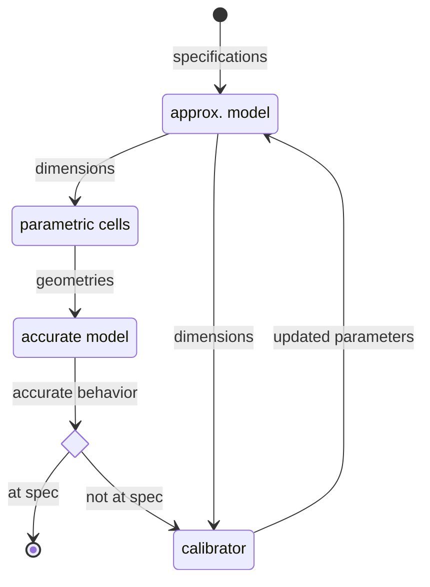

# HADES
## High-frequency Analog DESigner
This project is a prototype. Its goal is to create a technological and
software-agnostic design flow, from device sizing to layout and implementation.

## Structure
### Logiciel
- créer un nouveau dossier de travail
- lance une conception dans une technologie choisie

- visualise le résultat (performance, gdsII, ...)

### Bibliothèques partagées
 - Composants génériques
   - cellule paramétrique
     - entrée: dimension
     - sortie: géométrie ou schema
   - modèle approché
     - entrée: specification et paramètres
     - sortie: dimension
   - modèle précis
     - entrée: géométrie ou schema et fichier technologique
     - sortie: comportement
   - ajusteur:
     - entrée: comportement et dimension
     - sortie: paramètres
 - Kit technologique
   - version des logiciels
   - configuration des composants
   - pdk gds factory ?

### Dossier de travail
- configuration
  - techno cible
  - specification cible
  - racine
- schema racine
- layout racine

## Flow envisagé
Pour la partie "bloc" (schéma contenant des composants électronique)
- Saisie d'une architecture avec visualisation du schéma.
- Dimensionnement des composants (méthode gm/id, optimisation, ...). On crée 
le lien entre spécifications (gain, consommation, ...) et dimension (largeur, longueur de grille, ...)
- Placement des composants (système de matrice) et routage par directive (fils XX placé sur la 3ième ligne).
- Implémentation dans une technologie cible avec execution en boucle des étapes suivante + extraction des parasites.

## Pour la partie "module" (schéma contenant uniquement des blocs)
- 