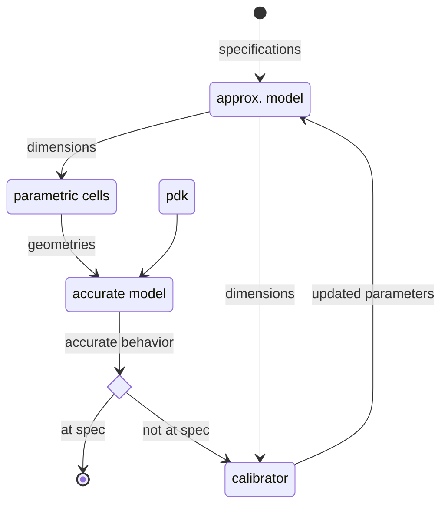

# HADES
## High-frequency Analog DESigner
This project is a prototype. Its goal is to create a technological and
software-agnostic design flow, from device sizing to layout and implementation.

## How to get started
Installation using pipx:

```shell
pipx install git+https://github.com/Patarimi/hades
```

## Design flow
Starting from the specifications written in a design.yml file, the following flow is run (see #working_dir).

When finished, a gds file is available for further design.

## Simulators and PDKs configuration
The simulator can be configured using:
```shell
hades config <simulator_name>
```
This command will write a simulator.yml file in the installation directory of hades.
The structure is the following:
```yaml
simulator_name:
  base_dir: path to root directory
  name: name of the binary file
  option:
    - list of option to configure the run
```

Similarly, a techno.yml file can be created at hades root with the following structure:
```yaml
techno_name:
  base_dir: path to the pdk directory root
  layer_map: path to the layermap (relative to the base_dir)
  process: path to the process file (-proc option in emx)
```

## Working directory
Configuration file design.yml. This file can be generated using:
```shell
hades template
```
It must contain at least:

```yaml
name: name of the output file
design:
  name: name of the component in the library
  specifications:
    key: pair of specification
techno:
```